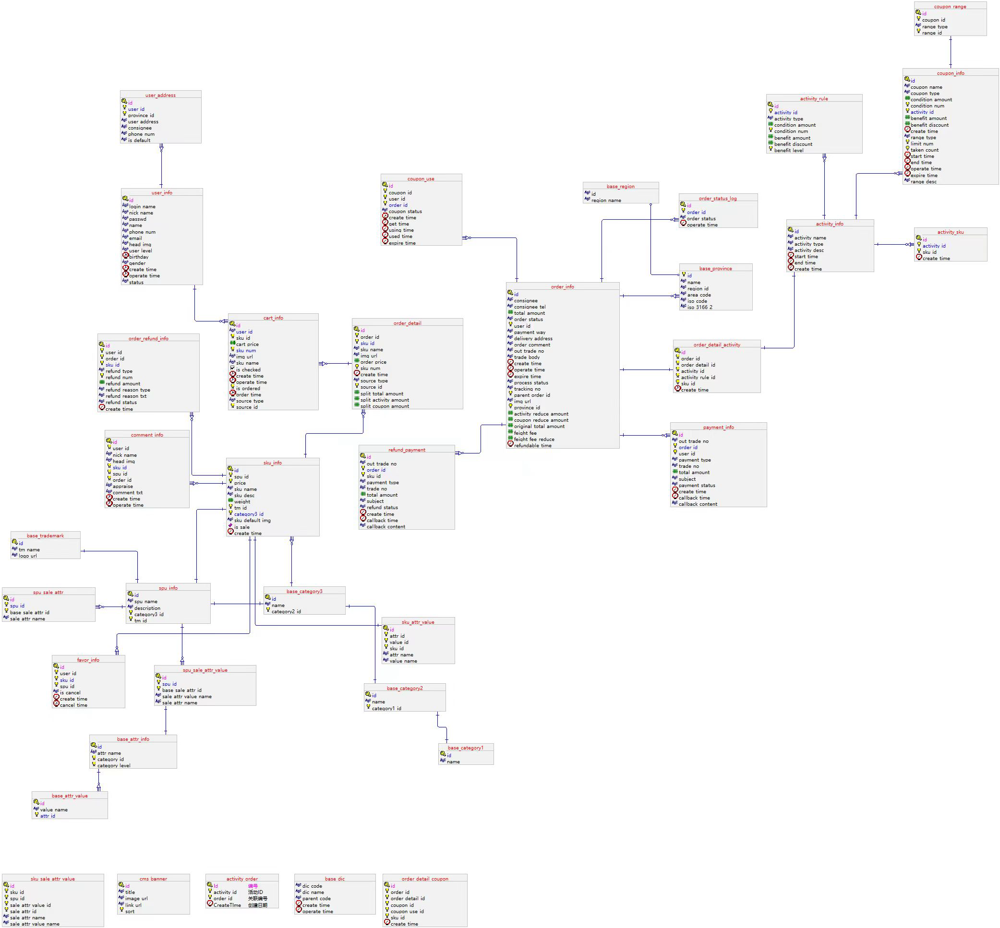

# E-commerce-BigData-Generator
电商大数据数据模拟，分为两部分数据的模拟，用户行为数据埋点日志和业务数据的模拟。

整体目录结构

```shell
.
├── README.md
├── businessDataGenerator    # 业务数据模拟
│   ├── application.properties
│   ├── gmall.sql
│   └── gmall2020-mock-db-2021-11-14.jar
├── log                      # 生成日志存放目录
│   └── app.2024-08-26.log
└── logDataGenerator         # 用户行为日志数据模拟
    ├── application.yml
    ├── gmall2020-mock-log-2021-10-10.jar
    ├── logback.xml
    └── path.json

```
1.用户行为埋点数据模拟

日志数据说明
https://weread.qq.com/web/reader/bfe32c50813ab823fg016ac3k8e232ec02198e296a067180

运行方式

在application.yml文件中配置业务日期，运行`java -jar gmall2020-mock-log-2021-10-10.jar`即可。

2.业务数据生成

业务数据说明
https://weread.qq.com/web/reader/bfe32c50813ab823fg016ac3k182326e0221182be0c5ca23

step1:建表

在数据库环境运行gmall.sql   

step2:生成数据
在businessDataGenerator/application.properties中修改数据库连接配置

运行`java -jar gmall2020-mock-db-2021-11-14.jar`

业务数据库表结构


